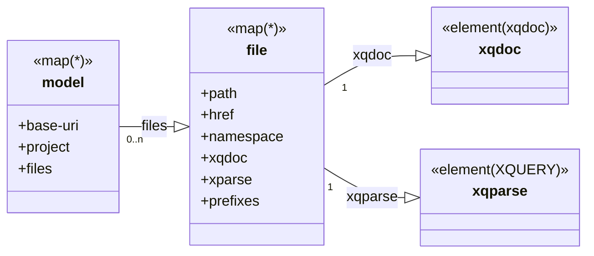

# XQdocA

Generate documentation from XQuery sources based on XQDoc style comments and also the use of annotations.

The outputs can be changed or extended with custom generators that are dynamically 
located and loaded at run time. 

A paper on this project was presented at [Markup UK](https://markupuk.org/) 2019.

*Generating documents from XQuery annotations* [HTML](https://markupuk.org/2019/webhelp/index.html#ar04.html) 

## Status

Work in progress.


* `Basex` 9.5.1+ http://basex.org/ 
* `ex-parse` 0.7.8+ (install from https://github.com/expkg-zone58/ex-xparse/releases/)

The code to be documented must be valid from the perspective of the version of BaseX used to run `XQdocA`. In particular any repository packages referenced by the code must be available.
## Install
1. unzip dist bundle to a folder, or clone the respostory
1. Add the `/bin` folder from above to your `PATH`
1. Execute `xqdoca -install` in a command window. 

The XQDocA script uses the `basex` script. If the environment variable `BASEX_HOME` is set it will run the basex script in that bin folder otherwise  it will search for basex on the `PATH`
## Requirements

The code to be processed must be syntactically valid from the perspective of the version of BaseX used to run `XQdocA`. In particular any repository packages referenced by the code must be available.
```xml
<package abbrev="xqdoca" name="https://github.com/Quodatum/xqdoca"
	version="0.7.0" spec="1.0" xmlns="http://expath.org/ns/pkg">
	<title>XQdocA - XQuery code documentation generator</title>
  <dependency processor="http://basex.org/" semver-min="9.5.1" semver-max="9.99.99"/>
  <dependency name="http://expkg-zone58.github.io/ex-xparse" semver-min="0.7.10" />
</package>
```

## Usage

`xqdoca -h` will display a summary of the options.

`xqdoca -h` will display a summary of the options.

XQDocA uses XML files to define documentation tasks. These typically use the extension `.xqdoca`

For example the file `samples/dba.xqdoca`
```xml
<xqdoca xmlns="urn:quodatum:xqdoca" version="1.0">
    <source>C:\Users\andy\basex.home\basex.951\webapp\dba</source>
    <target>file:///tmp/dba/</target>
</xqdoca>
```
Then `xqdoca samples/dba.xqdoca` will generate documentation for XQuery sources below `C:\Users\andy\basex.home\basex.951\webapp\dba` and write it to 
`file:///tmp/dba/`

If  `source` or `target` are relative urls they are resolved relative to the xqdoca file location. Additional elements can be used to control the generated outputs. Such as which renderers to run.
Options not specified in the .xqdoca file are taken from [config.xqdoca](src/main/config.xqdoca)


Values not specified in the `xqdoca` file are taken from the conf.xqdoca file
```xml
<!-- default options for xqdoca -->
<xqdoca xmlns="urn:quodatum:xqdoca" version="0.5">
    <source>C:\Users\andy\git\quodatum\xqdoca\</source>
    <target>file:///{webpath}/static/xqdoc/{project}/</target>
    <extensions>*.xqm,*.xq,*.xquery</extensions>
    <platform>basex</platform>
    <outputs>
        <global>report imports  annotations restxq mermaid xqdoca.xml</global>
        <module>module xqdoc xqparse</module>
    </outputs>
</xqdoca>
```


## Built-in generators

```xquery
map {
  "output": "xhtml",
  "name": "report",
  "uri": "index.html",
  "function": Q{quodatum:build.xqdoc-html}index-html2#2,
  "type": Q{https://github.com/Quodatum/xqdoca}global,
  "description": "Index of sources"
}
map {
  "output": "html5",
  "name": "restxq",
  "uri": "restxq.html",
  "function": Q{quodatum:build.xqdoc-html}restxq#2,
  "type": Q{https://github.com/Quodatum/xqdoca}global,
  "description": "Summary of REST interface"
}
map {
  "output": "html5",
  "name": "import",
  "uri": "imports.html",
  "function": Q{quodatum:build.xqdoc-html}imports#2,
  "type": Q{https://github.com/Quodatum/xqdoca}global,
  "description": "Summary of import usage"
}
map {
  "output": "html5",
  "name": "annoations",
  "uri": "annotation.html",
  "function": Q{quodatum:build.xqdoc-html}annotations#2,
  "type": Q{https://github.com/Quodatum/xqdoca}global,
  "description": "Summary of Annotation use"
}
map {
  "output": "xml",
  "name": "xqdoc",
  "uri": "xqdoc.xml",
  "function": Q{quodatum:build.xqdoc-html}xqdoc#3,
  "type": Q{https://github.com/Quodatum/xqdoca}module,
  "description": "xqDoc file for the source module"
}
map {
  "output": "xml",
  "name": "xqparse",
  "uri": "xqparse.xml",
  "function": Q{quodatum:build.xqdoc-html}xqparse#3,
  "type": Q{https://github.com/Quodatum/xqdoca}module,
  "description": "xqparse file for the source module"
}
map {
  "output": "html5",
  "name": "module",
  "uri": "index.html",
  "function": Q{quodatum:xqdoca.mod-html}xqdoc-html2#3,
  "type": Q{https://github.com/Quodatum/xqdoca}module,
  "description": "Html5 page created from the XQuery source"
}
```
## Customization
The available output generators are determined by scanning the `generators` folder for functions
containing annotations in the `https://github.com/Quodatum/xqdoca` namespace, usually bound to the 
prefix `xqdoca`

 Two kinds of generator are currently defined: `global` and `module`. 
 
### Global generators
These functions generate one output file derived from the entire source.
They have the `xqdoca:global` annotation.
The first parameter is an arbitary name used to reference the generator in the run `options`
The second is a simple text description.
The function must be of arity 2 and is called with the state and options as arguments.
Example:
```xquery
declare 
%xqdoca:global("index","Index of sources")
%xqdoca:output("index.html","html5") 
function xqhtml:index-html2($state as map(*),
                            $opts as map(*)
                            )
as document-node()          
```

### Module generators
These functions generate one file per XQuery source file.
The function must be of arity 3 and is called once for each source module 
with the current file state and options and the state as arguments.
Example:
```xquery
declare 
%xqdoca:module("module","Html5 page created from the XQuery source")
%xqdoca:output("index.html","html5")
function xqh:xqdoc-html2($file as map(*),
                            $opts as map(*),
                            $state as map(*)
                            )
as document-node()
```
                  
### Serialization
All generator functions require an output annotation that controls the name and serialization of that output.
The first parameter controls the name of the generated output. The second the serialization required.
Examples:
```xquery
%xqdoca:output("index.html","html5")
%xqdoca:output("swagger.json","json")
%xqdoca:output("xqparse.xml","xml")  
``` 
#### current serialization types
```xquery
(:~ defined serialization options :)
declare variable $xqo:outputs:=map{                                   
                  "html5": map{"method": "html", "version":"5.0", "indent": "no"},
                  "xhtml": map{"method": "xhtml", "version":"1.1","indent": "no"},
                  "xml": map{"indent": "no"},
                  "json": map{"method": "json"},
                  "text": map{"method": "text"}
                };
```
## Development notes
`xqdoca` execution scans the source folder to locate XQuery sources. These are then analysed using a 
combination of the `ex-parse` package and the BaseX `inspect:xqdoc` function.

The results are used to create an in-memory map


### File
*  "index": $pos,
*  "path": translate($file,"\","/"),
*  "href": ``[modules/`{ $id }`/]``,
*  "parsed": $isParsed,
*  "prefixes": xqd:namespaces( $analysis?xqdoc),
*  "annotations": xqd:anno($analysis?xqdoc), (: sequence map{annotation:, xqdoc: } :)
*  "namespace":$analysis?xqdoc/xqdoc:module/xqdoc:uri/string(), 
*  "default-fn-uri": xqp:default-fn-uri($analysis?xqparse) 

The renderers use this map to build their outputs.

### expath-pkg.xml
The EXpath packaging [specification](http://expath.org/spec/pkg) is used to define the XQDocA version and also the semantic version requirements of it's dependencies.
## License

XQdocA is released under the Apache License, Version 2.0

## Third party components

* Semantic versioning by https://github.com/eXist-db/semver.xq
* XQuery source highlighting by Prism (https://prismjs.com/)
* The diagram rendering by Mermaid https://github.com/mermaid-js/mermaid

## Credit, Acknowledgements

* Thanks to Darin McBeath for creating the original xqDoc http://xqdoc.org/.
* XQdocA has much in common with https://github.com/xquery/xquerydoc

* XQuery parsers were generated from EBNF using Gunther Rademacher's excellent http://www.bottlecaps.de/rex/


