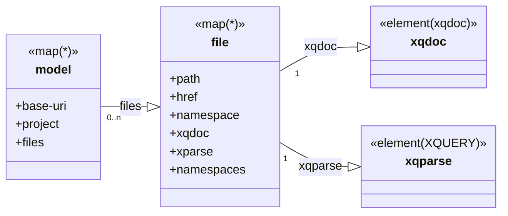

## About `xqdoca`
`XQDocA` is a tool to generate documentation from XQuery sources. It makes use of XQDoc style comments and XQuery annotations.

The outputs can be changed or extended with custom generators or "renderers" that are dynamically 
located and loaded at run time. 

A paper on this project was presented at [Markup UK](https://markupuk.org/).

*Generating documents from XQuery annotations*  Andy Bunce, [2019](https://markupuk.org/2019/webhelp/index.html#ar04.html).


- [About `xqdoca`](#about-xqdoca)
- [Status](#status)
- [Install](#install)
- [Usage](#usage)
  - [The .xdoca format](#the-xdoca-format)
- [Configuration](#configuration)
- [Built-in generators](#built-in-generators)
- [Customization](#customization)
  - [Global generators](#global-generators)
  - [Module generators](#module-generators)
  - [Serialization](#serialization)
    - [current serialization types](#current-serialization-types)
- [Development notes](#development-notes)
  - [File](#file)
  - [expath-pkg.xml](#expath-pkgxml)
- [License](#license)
- [Third party components](#third-party-components)
- [Credit, Acknowledgements](#credit-acknowledgements)


## Status

Work in progress.

## Install
1. Ensure `BaseX 10` is install
1. unzip dist bundle to a folder, or clone the respository
1. Add the `/bin` folder from above to your `PATH`
1. Execute `xqdoca -install` in a command window to ensure required repository modules are installed. 

The XQDocA script `xqdoca` uses the `basex` script. If the environment variable `BASEX10` is set it will run the basex script in that bin folder otherwise  it will search for basex on the `PATH`


## Usage
Running `xqdoca -h` display usage information.
```bash
xqdoca -h
using C:\Users\mrwhe\Desktop\basex.home\basex.107\bin\basex.bat

Usage xqdoca [options] [files]
   [files]  names of xqdoca files to run,
            if none supplied and a .xqdoca file exists in the current directory it will be run.
   -v       display version
   -h       display this help
   -init    create .xqdoca file in current directory if missing
   -update  update XQdocA required packages (as specified in expath-pkg.xml).
```

`XQDocA` uses XML files to define documentation tasks. These files typically use the extension `.xqdoca`.

 The `xqdoca` command expects the path to the task file to be passed as an argument. If no arguments or options are passed and a `.xqdoca` file is found in the current directory it will use that.

### The .xdoca format

A simple example `samples/dba.xqdoca`
```xml
<xqdoca xmlns="urn:quodatum:xqdoca" version="1.0">
   <source>C:\Users\andy\basex.home\basex.951\webapp\dba</source>
  <target>file:///tmp/dba/</target>
</xqdoca>
```
Then 
```xqdoca samples/dba.xqdoca``` 
will generate documentation for XQuery sources in `C:\Users\andy\basex.home\basex.951\webapp\dba` and write it to the folder `file:///tmp/dba/`

If  `source` or `target` are relative urls they are resolved relative to the `.xqdoca` file location. Additional elements can be used to control the generated outputs. Such as which renderers to run.
Options not specified in the .xqdoca file are taken from [config.xqdoca](src/main/config.xqdoca)


## Configuration
As used in `.xqdoc` files
| XPath from root                                     | Description| Example |
| --------------------------------------------------- | ---------- | ------- |
| `source` | directory containing source files | `C:\....\basex.951\webapp\dba`     |
| `target`  | directory for output           | `file:///tmp/dba/`        |
|extensions|comma delimited extensions to process|*.xqm,*.xq,*.xquery|
|platform|system type, ignored|basex|
|outputs/global|space delimited names of global renderers to use|report restxq|

## Built-in generators

```xquery
map {
  "output": "xhtml",
  "name": "report",
  "uri": "index.html",
  "function": Q{quodatum:build.xqdoc-html}index-html2#2,
  "type": Q{https://github.com/Quodatum/xqdoca}global,
  "description": "Index of sources"
}
map {
  "output": "html5",
  "name": "restxq",
  "uri": "restxq.html",
  "function": Q{quodatum:build.xqdoc-html}restxq#2,
  "type": Q{https://github.com/Quodatum/xqdoca}global,
  "description": "Summary of REST interface"
}
map {
  "output": "html5",
  "name": "import",
  "uri": "imports.html",
  "function": Q{quodatum:build.xqdoc-html}imports#2,
  "type": Q{https://github.com/Quodatum/xqdoca}global,
  "description": "Summary of import usage"
}
map {
  "output": "html5",
  "name": "annoations",
  "uri": "annotation.html",
  "function": Q{quodatum:build.xqdoc-html}annotations#2,
  "type": Q{https://github.com/Quodatum/xqdoca}global,
  "description": "Summary of Annotation use"
}
map {
  "output": "xml",
  "name": "xqdoc",
  "uri": "xqdoc.xml",
  "function": Q{quodatum:build.xqdoc-html}xqdoc#3,
  "type": Q{https://github.com/Quodatum/xqdoca}module,
  "description": "xqDoc file for the source module"
}
map {
  "output": "xml",
  "name": "xqparse",
  "uri": "xqparse.xml",
  "function": Q{quodatum:build.xqdoc-html}xqparse#3,
  "type": Q{https://github.com/Quodatum/xqdoca}module,
  "description": "xqparse file for the source module"
}
map {
  "output": "html5",
  "name": "module",
  "uri": "index.html",
  "function": Q{quodatum:xqdoca.mod-html}xqdoc-html2#3,
  "type": Q{https://github.com/Quodatum/xqdoca}module,
  "description": "Html5 page created from the XQuery source"
}
```
## Customization
The available output generators are determined by scanning the `generators` folder for functions
containing annotations in the `https://github.com/Quodatum/xqdoca` namespace, usually bound to the 
prefix `xqdoca`

 Two kinds of generator are currently defined: `global` and `module`. 
 
### Global generators
These functions generate one output file derived from the entire source tree.
They have the `xqdoca:global` annotation.
The first parameter is an arbitary name used to reference the generator in the run `options`
The second is a simple text description.
The function must be of arity 2 and is called with the state and options as arguments.
Example:
```xquery
declare 
%xqdoca:global("index","Index of sources")
%xqdoca:output("index.html","html5") 
function xqhtml:index-html2($state as map(*),
                            $opts as map(*)
                            )
as document-node()          
```

### Module generators
These functions generate one file per XQuery source file.
The function must be of arity 3 and is called once for each source module 
with the current file state and options and the state as arguments.
Example:
```xquery
declare 
%xqdoca:module("module","Html5 page created from the XQuery source")
%xqdoca:output("index.html","html5")
function xqh:xqdoc-html2($file as map(*),
                            $opts as map(*),
                            $state as map(*)
                            )
as document-node()
```
                  
### Serialization
All generator functions require an output annotation that controls the name and serialization of that output.
The first parameter controls the name of the generated output. The second the serialization required.
Examples:
```xquery
%xqdoca:output("index.html","html5")
%xqdoca:output("swagger.json","json")
%xqdoca:output("xqparse.xml","xml")  
``` 
#### current serialization types
```xquery
(:~ defined serialization options :)
declare variable $xqo:outputs:=map{                                   
                  "html5": map{"method": "html", "version":"5.0", "indent": "no"},
                  "xhtml": map{"method": "xhtml", "version":"1.1","indent": "no"},
                  "xml": map{"indent": "no"},
                  "json": map{"method": "json"},
                  "text": map{"method": "text"}
                };
```
## Development notes
`basex -bconfig-path=.xqdoca src\main\xqdoca.xq`

`xqdoca` execution scans the source folder to locate XQuery sources. These are then parsed using the `ex-parse` package and a xqdoc file generated from the parse.

The results are used to create an in-memory map


```mermaid
classDiagram
   direction LR
   class model{
   <<map(*)>>
   +base-uri
   +project
   +files
   }
   class file{
    <<map(*)>>
    +path
    +href
    +namespace
    +xqdoc
    +xparse
    +namespaces
   }
   class xqdoc{
    <<element(xqdoc)>>
    }
   class xqparse {
   <<element(XQUERY)>>
   }
   model "0..n" --|> file : files
   file "1" --|> xqdoc : xqdoc
   file "1" --|> xqparse : xqparse
```
### File
*  "index": $pos,
*  "path": translate($file,"\","/"),
*  "href": ``[modules/`{ $id }`/]``,
*  "parsed": $isParsed,
*  "prefixes": xqd:namespaces( $analysis?xqdoc),
*  "annotations": xqd:anno($analysis?xqdoc), (: sequence map{annotation:, xqdoc: } :)
*  "namespace":$analysis?xqdoc/xqdoc:module/xqdoc:uri/string(), 
*  "default-fn-uri": xqp:default-fn-uri($analysis?xqparse) 

The renderers use this map to build their outputs.

### expath-pkg.xml
The EXpath packaging [specification](http://expath.org/spec/pkg) is used to define the XQDocA version and also the semantic version requirements of it's dependencies.
## License

XQdocA is released under the Apache License, Version 2.0

## Third party components

* Semantic versioning from eXist-db https://github.com/eXist-db/semver.xq
* XQuery source highlighting by Prism (https://prismjs.com/)
* The diagram rendering by Mermaid https://github.com/mermaid-js/mermaid

## Credit, Acknowledgements

* Thanks to Darin McBeath for creating the original xqDoc http://xqdoc.org/.
* XQdocA has much in common with https://github.com/xquery/xquerydoc

* XQuery parsers were generated from EBNF using Gunther Rademacher's excellent [REx parser generator](http://www.bottlecaps.de/rex/)


